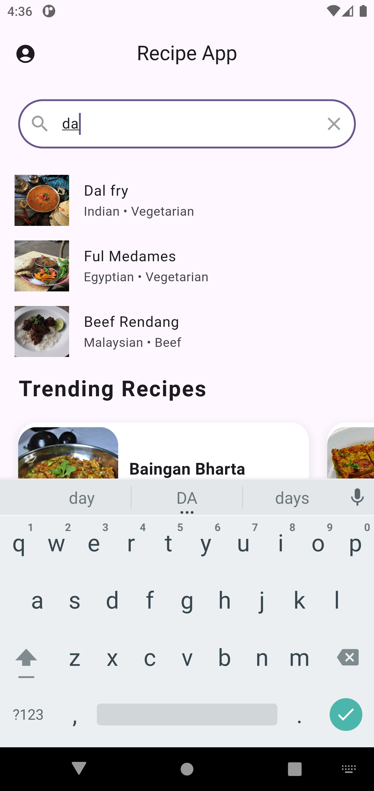
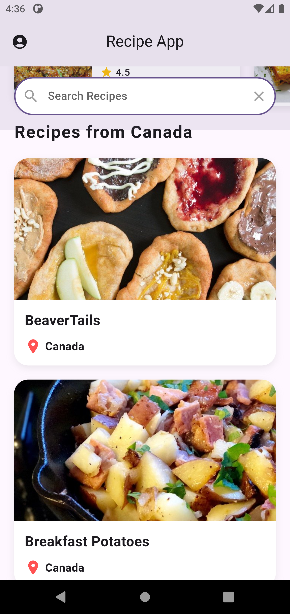
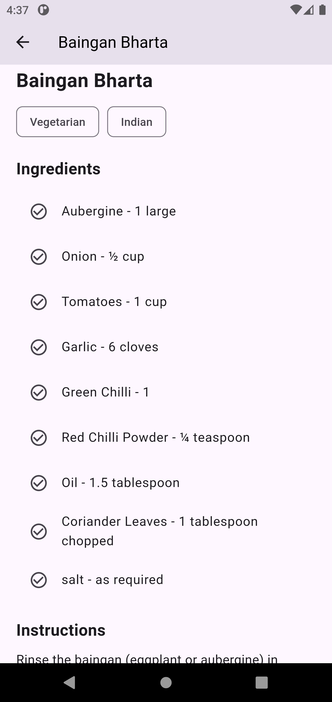
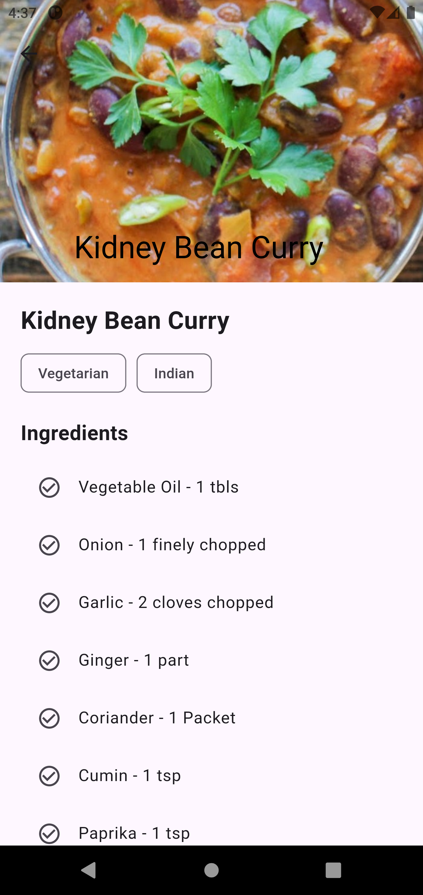

# 🍲 Flutter Recipe App

This is a clean and responsive **Recipe App** built with **Flutter** and **Provider**. It fetches recipe data dynamically from [TheMealDB API](https://www.themealdb.com/api.php), allowing users to search recipes, view trending dishes, and explore recipes by country.

---

## ✨ Features

- **Dynamic Recipe Search**:
  - Real-time search functionality using Provider state management.
  - Pinned search bar implemented with Flutter Slivers for optimal UX.
  
- **Detailed Recipe View**:
  - View detailed information about each recipe, including:
    - Recipe image
    - Ingredients list
    - Step-by-step cooking instructions
  
- **Trending Recipes Section**:
  - Displays featured or trending recipes fetched from the API.
  
- **Recipes by Country**:
  - Dedicated sections showcasing recipes from specific countries.

---

## 🛠️ Technologies & Libraries

- **Flutter**
- **Provider** (State management)
- **HTTP package** (API integration)
- **CustomScrollView & Slivers** (Advanced scrolling UI)


## 🖥️ Screenshots

### HomePage

<p align="center">
  
  
  
</p>

### Recipe Details

<p align="center">
  
  
</p>

---


---
## 🚀 Getting Started

### Prerequisites
- Flutter SDK installed
- Dart SDK configured
- Android Studio / VS Code set up

### Installation & Running

Clone the repository:

```bash
git clone https://github.com/ain-py/flutter-recipe-app.git
